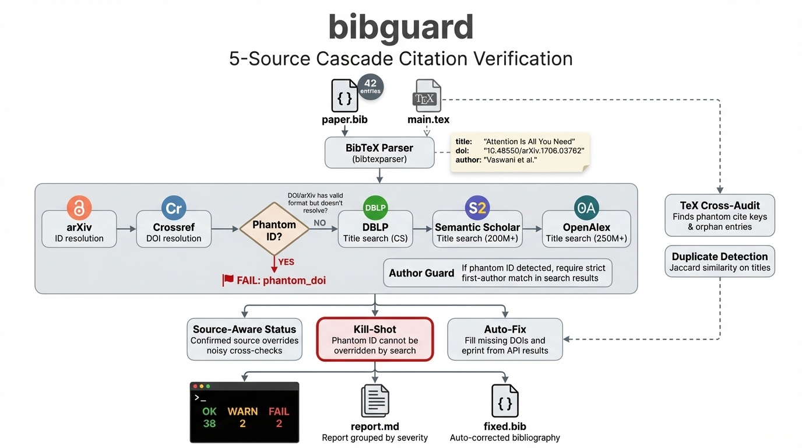

# bibguard

[](https://pypi.org/project/bibguard/)
[](https://www.npmjs.com/package/bibguard)
[](https://pypi.org/project/bibguard/)
[](LICENSE)
[]()

**Detect hallucinated and broken citations in academic papers.**

One command to verify every reference in your `.bib` file against five scholarly databases. Catches phantom DOIs, fabricated arXiv IDs, author mismatches, retracted papers, and AI-hallucinated citations.

```bash
pip install bibguard        # Python
npx bibguard paper.bib      # Node.js (zero install)
```



[Landing Page](https://geoffreywang1117.github.io/bibguard/) | [PyPI](https://pypi.org/project/bibguard/) | [npm](https://www.npmjs.com/package/bibguard) | [Desktop App](https://github.com/GeoffreyWang1117/bibguard-desktop/releases) | [Browser Extension](https://github.com/GeoffreyWang1117/bibguard-ext) | [Changelog](CHANGELOG.md)

---

## Why

Large language models hallucinate citations. Copy-paste errors corrupt metadata. Retracted papers slip through review. `bibguard` catches these problems **before** submission.

- **5 sources**: arXiv, Crossref, DBLP, Semantic Scholar, OpenAlex
- **Phantom ID detection**: Valid-format DOI/arXiv that doesn't resolve = hallucination signal
- **Kill-shot logic**: A phantom ID cannot be overridden by a similar search result
- **TeX cross-audit**: Find `\cite{key}` with no `.bib` entry, and orphan entries never cited
- **Duplicate detection**: Flag near-identical entries with different keys
- **Auto-fix**: Generate a corrected `.bib` with missing DOIs and eprint IDs filled in
- **Type-aware**: `@misc`/`@online` entries won't false-alarm as "hallucinated"
- **Zero heavy dependencies**: Core requires only `requests` + `bibtexparser`

## Install

```bash
# Python
pip install bibguard            # minimal
pip install bibguard[fast]      # + RapidFuzz for better title matching
pip install bibguard[all]       # + RapidFuzz + PyMuPDF for PDF parsing

# Node.js / TypeScript (zero dependencies)
npx bibguard paper.bib          # run directly
npm install bibguard             # as library

# Desktop app (no terminal needed)
# Download from https://github.com/GeoffreyWang1117/bibguard-desktop/releases

# Browser extension
# Download from https://github.com/GeoffreyWang1117/bibguard-ext
```

Python requires 3.9+. Node.js requires 18+. Desktop app requires no dependencies.

## Usage

### CLI

```bash
# Basic: verify all entries in a .bib file
bibguard references.bib

# With TeX cross-audit (finds phantom \cite and orphan entries)
bibguard references.bib --tex main.tex

# Save report + auto-fix
bibguard references.bib --tex main.tex --out report.md --fix fixed.bib

# Parallel verification (auto-selects workers for large files)
bibguard references.bib -w 4

# JSON output (for CI pipelines)
bibguard references.bib --json --out report.json
```

### Python API

```python
from bibguard import verify_bib, verify_entry

# Verify entire .bib file (parallel with 4 workers)
results, report = verify_bib("references.bib", tex_path="main.tex", workers=4)
for r in results:
    if r.overall != "OK":
        print(f"{r.overall}: {r.key} -- {r.title}")

# Verify a single entry
from bibguard.parsers.bibtex import parse_bib
entries = parse_bib("references.bib")
result = verify_entry(entries[0])
print(result.overall, result.checks)
```

### TypeScript / Browser

```typescript
import { parseBib, verifyAll } from "bibguard";

const entries = parseBib(bibText);
const results = await verifyAll(entries, (i, total, key, status) => {
  console.log(`[${i}/${total}] ${key}: ${status}`);
});
```

All 5 APIs support CORS — works directly in the browser without a proxy.

### Exit codes

| Code | Meaning |
|------|---------|
| 0 | All entries OK or WARN |
| 1 | At least one FAIL |
| 2 | Input error (file not found) |

## Benchmark

### Golden test set (58 cases)

Reproduce with `python tests/bench_golden.py`.

| Category | Metric | Result |
|----------|--------|--------|
| **Hallucinated** (14 fabricated) | Detected as FAIL | **14/14 (100%)** |
| **Chimera** (5 mixed-metadata) | Detected as >= WARN | **5/5 (100%)** |
| **Real papers** (10 legitimate) | False positive (FAIL) | 0/10 (0%) |

### Large-scale validation (200 cases)

Sampled from crawled datasets (800 hallucinated, 400 chimera, 656 real, 153 retracted). Reproduce with `python tests/bench_large.py`.

| Category | N | OK | WARN | FAIL | Key metric |
|----------|---|-----|------|------|-----------|
| **Hallucinated** | 50 | 0 | 0 | 50 | **100% detected (all FAIL)** |
| **Chimera** | 50 | 0 | 18 | 32 | **100% detected** |
| **Real papers** | 50 | 43 | 7 | 0 | **86% clean, 0% false positive** |
| **Retracted** | 50 | 49 | 1 | 0 | 2% flagged (L0 limitation) |

For semantic NLI, citation graph analysis, and Bayesian risk scoring, see [IntegriRef](https://github.com/GeoffreyWang1117/IntegriRef).

## AI Coding Assistant Integration

bibguard ships with skill/rule definitions for major AI coding assistants.

### Claude Code

```bash
mkdir -p ~/.claude/commands
curl -o ~/.claude/commands/bibguard.md \
  https://raw.githubusercontent.com/GeoffreyWang1117/bibguard/main/.claude/commands/bibguard.md
```
Then use `/bibguard paper.bib` in Claude Code.

### OpenAI Codex CLI

```bash
mkdir -p ~/.codex/skills/bibguard
curl -o ~/.codex/skills/bibguard/SKILL.md \
  https://raw.githubusercontent.com/GeoffreyWang1117/bibguard/main/.codex/skills/bibguard/SKILL.md
```

### Cursor

```bash
mkdir -p .cursor/rules
curl -o .cursor/rules/bibguard.md \
  https://raw.githubusercontent.com/GeoffreyWang1117/bibguard/main/.cursor/rules/bibguard.md
```

### Any other assistant

```
bibguard paper.bib --json --out report.json
```

## API sources

| Source | Lookup method | CORS | Coverage |
|--------|--------------|------|----------|
| arXiv | ID resolution | Yes | CS, Physics, Math |
| Crossref | DOI resolution | Yes | 150M+ records |
| DBLP | Title search | Yes | CS papers |
| Semantic Scholar | Title search | Yes | 200M+ papers |
| OpenAlex | Title search | Yes | 250M+ works |

All queries respect rate limits. No API keys required.

## Contributing

```bash
git clone https://github.com/GeoffreyWang1117/bibguard.git
cd bibguard
pip install -e ".[dev]"
pytest
```

## Related

- [IntegriRef](https://github.com/GeoffreyWang1117/IntegriRef) -- Full L0-L4 verification stack with semantic NLI (93.5%), citation graph analysis, and Bayesian risk scoring
- [bibguard-desktop](https://github.com/GeoffreyWang1117/bibguard-desktop) -- Cross-platform desktop app (Windows/macOS/Linux, no dependencies)
- [bibguard-js](https://github.com/GeoffreyWang1117/bibguard-js) -- TypeScript version (zero deps, browser-native)
- [bibguard-ext](https://github.com/GeoffreyWang1117/bibguard-ext) -- Chrome/Firefox browser extension

## Contributors

See [CONTRIBUTORS.md](CONTRIBUTORS.md) for detailed attribution.

- **Geoffrey Wang** -- Architecture, core algorithms, phantom-ID detection, kill-shot logic, benchmark design
- **Claude (Anthropic)** -- Modular refactoring, output formatting, packaging, documentation

## Support

If you find bibguard useful, please consider giving it a **star** on GitHub — it helps others discover the project.

[](https://github.com/GeoffreyWang1117/bibguard)

Have a bug report, feature request, or suggestion? [Open an issue](https://github.com/GeoffreyWang1117/bibguard/issues) — all feedback is welcome.

## Roadmap

- ~~**Parallel verification**~~ — **Shipped in v0.3.1**: `--workers N` flag for concurrent verification via thread pool
- **Async I/O** — migrate from `requests` to `asyncio` + `aiohttp` for further speedup on 500+ entry files
- **Batch API queries** — leverage Crossref, Semantic Scholar, and OpenAlex batch endpoints to reduce per-entry overhead
- **Caching layer** — local cache for repeated lookups across runs
- **Retracted paper detection** — integrate Retraction Watch database for L0-level retraction flagging

## License

Apache License 2.0. See [LICENSE](LICENSE) for details.

---

<details>
<summary><strong>中文说明</strong></summary>

# bibguard — 学术论文引用幻觉检测工具

**一行命令，检测论文中的虚假引用。** Python + TypeScript + 浏览器扩展。

```bash
pip install bibguard        # Python
npx bibguard paper.bib      # Node.js
```

### 核心能力

- **幽灵 DOI / arXiv ID 检测** -- 格式正确但不存在 = 最强幻觉信号
- **Kill-shot 逻辑** -- 幽灵 ID 不会被相似论文的搜索结果覆盖
- **@misc 类型感知** -- 非论文条目（新闻、文档等）不会误报为幻觉
- **TeX 交叉审计** -- 检测 `\cite{key}` 在 `.bib` 中无定义的条目
- **自动修复** -- 补全缺失的 DOI 和 eprint 字段

### 基准测试

| 测试集 | 幻觉检出 | 真论文假阳 (FAIL) | 真论文 OK 率 |
|--------|---------|-----------------|------------|
| Golden (58 条) | **100%** (14/14) | **0%** | -- |
| 大规模 (200 条) | **100%** (50/50) | **0%** | **86%** |

TypeScript 版零依赖，可直接在浏览器运行（5 个 API 全支持 CORS）。支持 Claude Code / Codex / Cursor。

完整版请使用 [IntegriRef](https://github.com/GeoffreyWang1117/IntegriRef)（L0-L4，含语义 NLI 93.5%、贝叶斯风险评分）。

### 支持项目

如果 bibguard 对你有帮助，欢迎在 GitHub 上点个 **Star** ⭐，帮助更多人发现这个工具。有建议或问题？欢迎[提 Issue](https://github.com/GeoffreyWang1117/bibguard/issues)。

### 路线图

- ~~**并行验证**~~ — **已在 v0.3.1 实现**：`--workers N` 线程池并行验证
- **异步 I/O** — 从 `requests` 迁移到 `asyncio` + `aiohttp`，进一步加速 500+ 条目文件
- **批量 API 查询** — 利用 Crossref、Semantic Scholar、OpenAlex 批量接口减少逐条开销
- **本地缓存** — 跨运行缓存已验证条目
- **撤稿论文检测** — 对接 Retraction Watch 数据库

</details>
